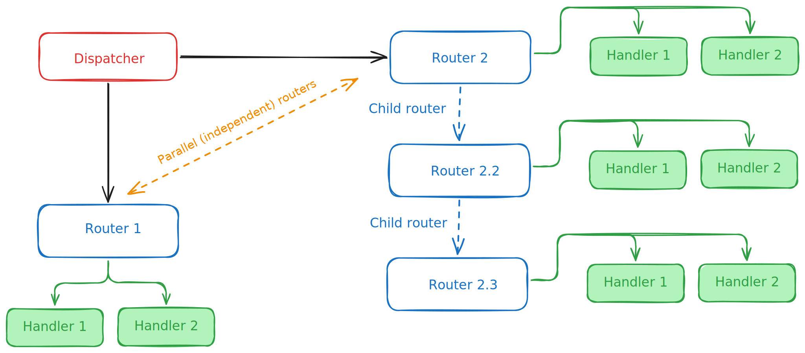

# Handling Requests

## Router

Whenever a user interacts with the bot — for example, via a direct message, or when the bot is added to a group chat or channel — the bot receives an **update** from the server.

To process these events, the `Router` is used. It defines which functions should be triggered upon receiving a specific type of update. This allows you to centrally manage the logic for handling various types of messages:

=== "Unnamed"
    ```python
    from trueconf import Router
    
    r = Router()
    ```

=== "Named"
    ```python
    from trueconf import Router
    
    r = Router(name="Router1")
    ```

To handle updates, the handler function is wrapped with a decorator. For example, to process the [`SendMessage`](https://trueconf.ru/docs/chatbot-connector/ru/messages/#newMessage) event, use the `@<router>.message()` decorator:

```python hl_lines="1"
@r.message()
async def on_message(message): ...
```

### Filter support

Routers support filters based on the [magic-filter](https://github.com/aiogram/magic-filter) library using the `F` object:

```python
from trueconf import F
```

Filters allow you to handle only those events (incoming updates) that match specific conditions. For example:

=== "Text message"
    ```python hl_lines="4"
    from trueconf import Router, F
    r = Router()
    
    @r.message(F.text)
    async def on_message(message): ...
    ```

=== "Image"
    ```python hl_lines="4"
    from trueconf import Router, F
    r = Router()

    @r.message(F.photo)
    async def on_photo(message): ...
    ```

=== "Message from a specific user"
    ```python hl_lines="4"
    from trueconf import Router, F
    r = Router()
    
    @r.message(F.from_user.id == "elisa")
    async def on_elisa(message): ...
    ```

!!! Tip
    You can find more detailed examples of filter usage in the [Filter section](filters.md).

## Registering routers in the dispatcher

All created routers must be registered with the main event handler — the `Dispatcher`.
It is responsible for объединяет the handlers and manages routing for incoming updates:

```python
from trueconf import Dispatcher

dp = Dispatcher()
dp.include_router(r)
```

As a rule, you may have many routers, but only one dispatcher:

```python hl_lines="7 14"
from trueconf import Bot, Router, Dispatcher
r1 = Router()
r2 = Router()
r3 = Router()
r4 = Router()

dp = Dispatcher()

dp.include_router(r1)
dp.include_router(r2)
dp.include_router(r3)
dp.include_router(r4)

bot = Bot(token="JWT-token", dispatcher=dp)
```

### Dynamic routers

We have looked at an example of creating a simple router that is defined in code in advance:

```python
from trueconf import Router, F
r = Router()

@r.message(F.from_user.id == "elisa")
async def on_elisa(message): ...
```

But what if you need to handle an event whose condition is not known beforehand?
This is where **dynamic router registration** (or *dynamic routers*) comes in.
As you have already seen, registering a handler is done via a decorator (`@<router>`).

!!! Note
    A **decorator** is a wrapper function that binds your code to a specific event.
    It “wraps” the handler function and registers it in the system so that when the event (trigger) occurs, the system knows exactly which code to run.

To register a router dynamically, use a *functional* decorator call — i.e., apply it without the `@decorator` syntax sugar.

```python hl_lines="7"
async def handle_message() ...

@r.message(Command("start"))
async def on_report(msg: Message):
    dynamic_r = Router()
    dp.include_router(dynamic_r)
    dynamic_r.message(F.from_user.id == msg.from_user.id)(handle_message)
```

!!! Example
    You can find a detailed example using a dynamic router in [our GitHub](https://github.com/TrueConf/python-trueconf-bot/blob/master/examples/report_bot.py).

### Removing a router from the dispatcher

Removing (deactivating) a router is typically needed when a dynamic router was created for a user and is no longer required.
The dispatcher keeps a list of all registered routers in `dp.routers`.
Accordingly, if you assigned a name like `Router(name="Cool")`, you can remove it as follows:

```python
for router in dp.routers[:]:# (1)!
    if router.name == "Cool":
         dp.routers.remove(router)
```

1. We iterate over a slice (a copy) of the list so the **for** loop does not break when an element is removed.

### Parallel and child routers

Routers can also be:

* **parallel**, processed independently of each other;
* **child** (dependent), processed in a chain.



Take a look at the diagram. When a new event arrives from the server, the dispatcher will process it as follows:

1. Send it for handling to **Router 1**.
2. Check the condition of the first handler, **Handler 1**. If it matches, proceed to **Router 2**.
   If it does not, check the next handler, **Handler 2**.
3. Regardless of whether any handlers in **Router 1** matched, the dispatcher proceeds to execute **Router 2**.

In **Router 2**, as shown, there are two child routers: **Router 2.3** is a descendant of **Router 2.2**, and **Router 2.2** is a descendant of **Router 2**.

Here, the event will be processed as follows:

1. If nothing matches in **Router 2**, then move on to **Router 2.2**.
2. If nothing matches in **Router 2.2**, then move on to **Router 2.3**.

As a result, **Handler 2** from **Router 2.3** will run only if no previous handler matched.

## Handler priorities

* Routers and their handlers are checked in the order they were added via `Dispatcher.include_router()`.
* Inside a single router, handlers are evaluated in the order they are declared.
* Upon the first filter match, the handler is executed and no further handlers are checked (default behavior).

This means that if you have multiple handlers with the same filter:

```python
@r.message(F.text == "Hello")
async def handler1(message):
    await message.answer("First")

@r.message(F.text == "Hello")
async def handler2(message):
    await message.answer("Second")
```

Then **only `handler1`** will be triggered, and `handler2` will be ignored.

To trigger both handlers, use different filters or combine the logic inside a single handler function.

!!! Tip
    For better logic separation, it's recommended to create multiple routers (e.g., `commands_router`, `messages_router`, `admin_router`) and include them in the dispatcher in the desired order. This helps organize your code and simplifies bot maintenance.

## Code Organization Best Practices

* Typically, routers are placed in separate modules (e.g., `handlers/messages.py`) and included in the main bot module via `include_router`.
* This helps separate handlers by responsibility: messages, photos, commands, etc.
* The dispatcher (`Dispatcher`) can be viewed as the central managing component that coordinates the logic for handling all incoming events.
