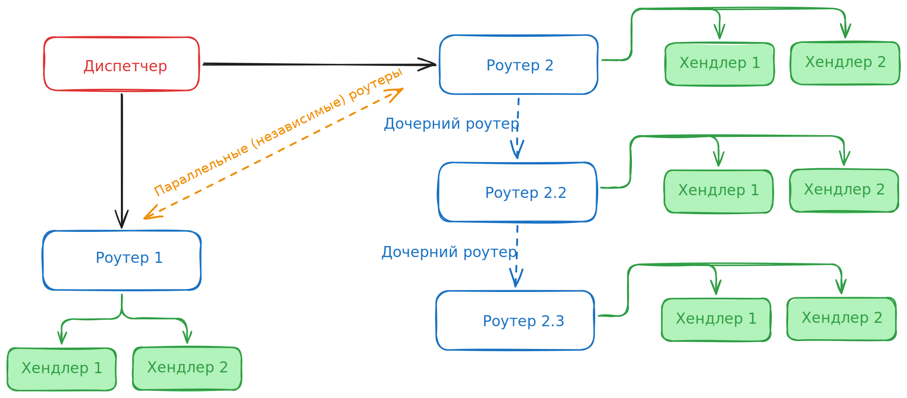

# Обработка запросов

## Роутер

При любом взаимодействии с ботом — например, при личном сообщении, добавлении в групповой чат или канал — бот получает **обновление (update)** от сервера.

Для обработки этих событий используется `Router`. Он определяет, какие функции нужно вызвать при получении конкретного типа апдейта. Это позволяет централизованно управлять логикой обработки различных типов сообщений:

=== "Без имени"
    ```python
    from trueconf import Router
    
    r = Router()
    ```

=== "С именем"
    ```python
    from trueconf import Router
    
    r = Router(name="Router1")
    ```

Чтобы отловить обновление функцию-обработчик оборачивают в декоратор, например, для события [`SendMessage`](https://trueconf.ru/docs/chatbot-connector/ru/messages/#newMessage) необходимо использовать декоратор `@<router>.message()`:

```python hl_lines="1"
@r.message()
async def on_message(message): ...
```

### Поддержка фильтров

Роутеры поддерживают фильтры на основе библиотеки [magic-filter](https://github.com/aiogram/magic-filter). Для этого используется объект `F`:

```python
from trueconf import F
```

Фильтры позволяют обрабатывать только те события (входящие обновления), которые соответствуют заданным условиям. Например:


=== "Текстовое сообщение"
    ```python hl_lines="4"
    from trueconf import Router, F
    r = Router()
    
    @r.message(F.text)
    async def on_message(message): ...
    ```

=== "Изображение"
    ```python hl_lines="4"
    from trueconf import Router, F
    r = Router()

    @r.message(F.photo)
    async def on_photo(message): ...
    ```

=== "Сообщение от пользователя"
    ```python hl_lines="4"
    from trueconf import Router, F
    r = Router()
    
    @r.message(F.from_user.id == "elisa")
    async def on_elisa(message): ...
    ```

!!! Tip
    Более подробные примеры использования фильтров вы можете найти в [разделе Фильтры](filters.md).

### Регистрация роутеров в диспетчере

Все созданные роутеры необходимо зарегистрировать в главном обработчике событий — диспетчере (Dispatcher).
Именно он объединяет обработчики и управляет маршрутизацией входящих обновлений (апдейтов):

```python
from trueconf import Dispatcher

dp = Dispatcher()
dp.include_router(r)
```

Как правило, роутеров может быть очень много, а диспетчер один:

```python hl_lines="7 14"
from trueconf import Bot, Router, Dispatcher
r1 = Router()
r2 = Router()
r3 = Router()
r4 = Router()

dp = Dispatcher()

dp.include_router(r1)
dp.include_router(r2)
dp.include_router(r3)
dp.include_router(r4)

bot = Bot(token="JWT-token", dispatcher=dp)
```

### Динамические роутеры

Мы рассмотрели пример создания простого роутера, который заранее описан в коде: 

```python
from trueconf import Router, F
r = Router()

@r.message(F.from_user.id == "elisa")
async def on_elisa(message): ...
```

Но, что делать, если нужно отлавливать событие условие которого заранее не определено?
На помощь приходит **динамическая регистрация роутеров** (или динамические роутеры).
Как вы уже видели регистрация обработчика происходит с помощью декоратора (`@<router>`).

!!! Note
    **Декоратор** — это функция-обертка, которая связывает программный код с конкретным событием. 
    Он «оборачивает» функцию-обработчик и регистрирует её в системе, чтобы при наступлении события (триггера) система знала, какой именно код нужно запустить.

Для динамической регистрации роутера нужно использовать функциональный вызов декоратора — способ применения без использования синтаксического сахара `@decorator`.

```python hl_lines="7"
async def handle_message() ...

@r.message(Command("start"))
async def on_report(msg: Message):
    dynamic_r = Router()
    dp.include_router(dynamic_r)
    dynamic_r.message(F.from_user.id == msg.from_user.id)(handle_message)
```

!!! Example
    Подробный пример кода с динамическим роутером вы найдете в [нашем GitHub](https://github.com/TrueConf/python-trueconf-bot/blob/master/examples/report_bot.py).

### Удаление роутера из диспетчера

Удаление роутера (его деактивация) зачастую нужно в случаях, когда для пользователя создавался динамический роутер и он больше не нужен.
Диспетчер хранит в себе список всех зарегистрированных роутеров `dp.routers`.
Соответственно, если вы задали имя `Router(name="Cool")`, то его легко можно удалить следующим образом: 

```python
for router in dp.routers[:]:# (1)!
    if router.name == "Cool"
         dp.routers.remove(router)
```

1. Используем копию списка через срез, чтобы цикл **for** не сломался при удалении элемента.

### Параллельные и дочерние роутеры

Роутеры также могут быть: 

- параллельные, которые обрабатываются независимо друг от друга.
- дочерние (зависимые), которые обрабатываются по цепочке. 



Взляните на схему! Когда придет новое событие от сервера, то диспетчер обработает его так: 

1. Отправит на обработку в **Роутер 1**.
2. Проверит условие первого обработчика **Хендлер 1**. Если он сработал, переходит к **Роутер 2**. 
Если нет, то проверяет следующий обработчик **Хендлер 2**.
3. В независимости от срабатывания обработчиков в **Роутере 1**, диспетчер переходит к выполнению **Роутер 2**. 

В **Роутер 2**, как мы видим, два дочерних роутера: **Роутер 2.3** является потомком **Роутер 2.2**, а **Роутер 2.2** является потомком **Роутер 2**.

Здесь событие будет обрабатываться следующим образом: 

1. Если ничего не сработало в **Роутер 2**, тогда перейти к **Роутер 2.2**. 
2. Если ничего не сработало в **Роутер 2.2**, тогда перейти к **Роутер 2.3**. 

Таким образом обработчик **Хендлер 2** из **Роутера 2.3** сработает только в том случае, если никакой до него не сработал. 

## Приоритеты обработчиков

* Роутеры и их обработчики проверяются в порядке подключения через Dispatcher.include_router().
* Внутри одного роутера обработчики также идут по порядку объявления.
* При первом совпадении фильтров обработчик выполняется, и дальнейшие совпадения не проверяются (поведение по умолчанию).

Это означает, что если у вас есть несколько обработчиков с одинаковыми фильтрами:

```python
@r.message(F.text == "Hello")
async def handler1(message):
    await message.answer("Первый")

@r.message(F.text == "Hello")
async def handler2(message):
    await message.answer("Второй")
```

То сработает **только handler1**, а до handler2 исполнение уже не дойдёт.

Чтобы задействовать оба обработчика, используйте разные фильтры или объедините их в один с дополнительной логикой внутри функции.

!!! Tip
    Для разделения логики рекомендуется создавать несколько роутеров (например, commands_router, messages_router, admin_router) и подключать их в диспетчере в нужном порядке. Такой подход помогает структурировать код и упрощает поддержку бота.

## Рекомендации по организации кода

- Обычно роутеры выносят в отдельные модули (например, handlers/messages.py), а затем подключают их в главном модуле бота через include_router.
- Это позволяет разделять обработчики по областям ответственности: сообщения, фото, командыа и т. д.
- Диспетчер (Dispatcher) можно рассматривать как центральный управляющий компонент, объединяющий логику обработки всех событий.


